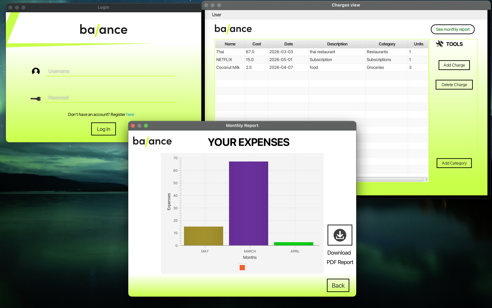

# Balance - Student Management App

A sleek JavaFX desktop application designed to help students track their expenses and manage their budgets effectively. This project was originally developed in **2024** by **Mario Pérez** and **Saúl Alcázar**.

Originally built as a NetBeans Ant-based project for Java 8, it has been fully audited and migrated to a modern **Maven** build system, ensuring compatibility with JDK 11 and beyond.

## Features

- **Expense Tracking:** Add and manage charges with details such as name, cost, date, units, and description.
- **Categorization:** Create custom categories to organize your spending.
- **Visual Insights:** Generate monthly reports and bar charts to visualize spending patterns.
- **PDF Reports:** Export your annual expense data to a PDF report for offline review.
* **Modern Setup:** Fully migrated to Maven with JavaFX 21 support.

## Preview

The application features a modern, high-contrast interface designed for clarity and ease of use.


## Prerequisites

To run this project, you need:
- **Java Development Kit (JDK) 11** or higher.
- **Maven 3.6** or higher.

## How to Launch

1. **Clone the repository:**
   ```bash
   git clone https://github.com/yourusername/balance.git
   cd balance
   ```

2. **Compile the project:**
   ```bash
   mvn clean compile
   ```

3. **Run the application:**
   ```bash
   mvn javafx:run
   ```

## Project Structure

- `src/`: Java source code and FXML view resources.
- `data.db`: Local SQLite database containing your management data.
- `pom.xml`: Maven configuration and dependency management.

---
*Created by Mario Pérez & Saúl Alcázar (2024)*
